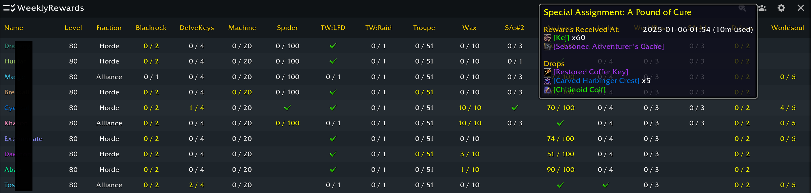

# WeeklyRewards: Simplify Your WoW Weekly Rewards Progress Tracking

WeeklyRewards offers a simple grid to track your weekly rewards progress across all characters. Quickly see what’s done and what needs attention. Stay organized and keep up with your progress effortlessly.

WeeklyRewards utilizes the UI design of [WeeklyKnowledge](https://github.com/DennisRas/WeeklyKnowledge), and all rights to the original UI design belong to WeeklyKnowledge.

## Slash Commands
- `/wr` - Open or close the main window.
- `/wr minimap` - Show or hide the minimap icon.
- `/wr debug` - Enanle or disble debug logs.
- Or use the full name command `/weeklyrewards`

## Issues and Feedback

We value your feedback! If you find bugs or have ideas for improvements, let us know to help make WeeklyRewards even better.